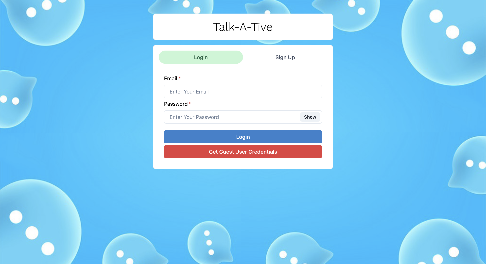
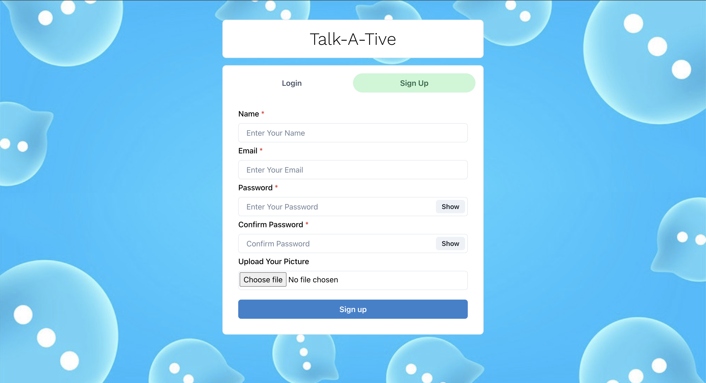
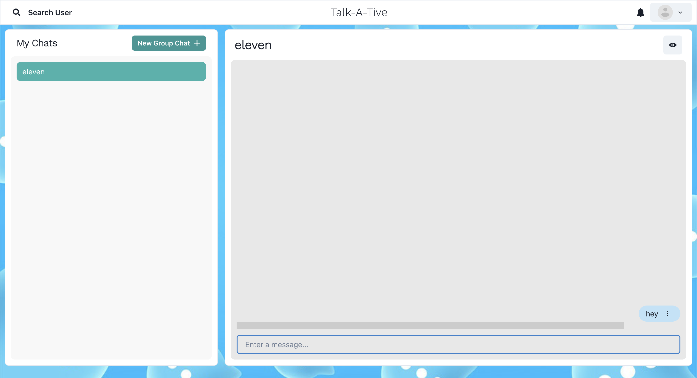
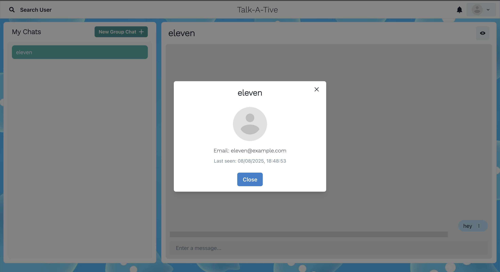
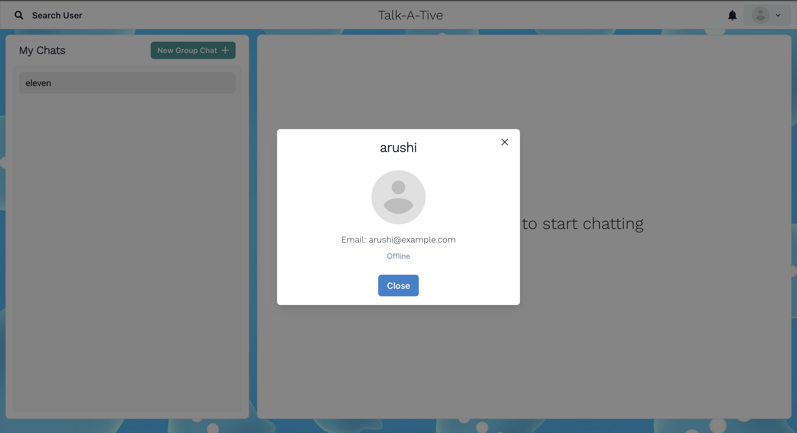

# 💬 Chat App

A full-stack real-time chat application built with the MERN stack and Socket.IO. Supports 1-on-1 and group chats, live typing indicators, message editing and deletion, real-time online/offline tracking with last seen and many more features that are yet to be added.

---

## 🚀 Tech Stack

**Frontend:**
- React
- Chakra UI
- Axios
- Socket.IO Client
- Lottie for typing animations

**Backend:**
- Node.js
- Express
- MongoDB + Mongoose
- Socket.IO Server
- JWT for Auth

**Utilities:**
- Cloudinary (for image uploads)
- Docker (for containerized deployment)

---

## 📸 Screenshots

🔐 Login Page:


📝 Signup Page:


💬 Chat Interface:


👤 Chat User Profile Modal:


🙍‍♀️ Current User Profile Modal:



## 🌐 Live Demo

🔗 [https://talk-a-tive-g20h.onrender.com/](https://talk-a-tive-g20h.onrender.com/)

---

## 📦 Running Locally with Docker

1. **Clone the repo**

```bash
git clone https://github.com/akshada-31/mern-chat-app.git
cd chat-app
